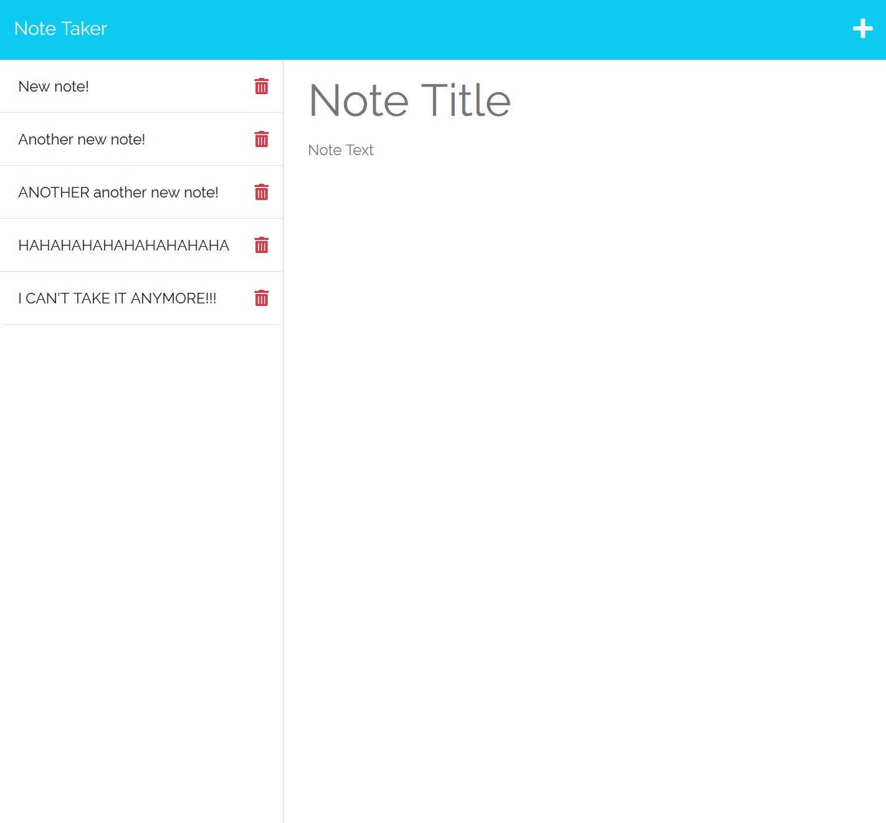

# Module 11 Weekly Challenge - Note Taker 

## Description

In the modern day, it is very easy to lose track of the myriad of things you need to stay on top of in everyday life, even moreso if you have a demanding job, such as being a business owner. Thus, this app allows a user to organize their thoughts and keep track of tasks that they need to complete.

## Usage

View the Note Taker here;

https://desolate-refuge-44043-95775ddd4e50.herokuapp.com

Upon visiting the site, you will be greeted by a landing page, within which will be a blue button with the text "Get Started".

Upon clicking it, you will be brought to the main notes page. On the left will be a column to house the notes you have created (though as of right now it should just say "No saved notes), and on the right will be a large panel you can use to create a new note. Enter your desired note title and text, and a "save" icon will appear in the top right of the page to the left of the '+' button. Clicking the save button will clear the note creation panel, and the note will be saved to the column on the left.

To view an already-existing note, click it in the left panel, and it will be loaded in a read-only state to the note creation panel on the right. To create a new note from this point, click the '+' button to start a new note. To delete a note, click the red "trash" icon to the right of a note's title in the column on the left, and it will be removed from the list & database.

## Preview

## Credits

reset.css file (./public/assets/css/reset.css);
https://meyerweb.com/eric/tools/css/reset/

MIT License Badge (./README.md, line 1);
https://gist.github.com/lukas-h/2a5d00690736b4c3a7ba

uuid.js file (./helpers/uuid.js);
https://git.bootcampcontent.com/University-of-Toronto/UTOR-VIRT-FSF-PT-07-2023-U-LOLC/-/tree/main

findIndex() syntax (./routes/notes.js, line 82);
https://stackoverflow.com/questions/44383111/findindex-javascript-array-object

## License

Operates under a standard MIT license. For more information, refer to the LICENSE file in the repository, or visit the following website; https://opensource.org/licenses/MIT.